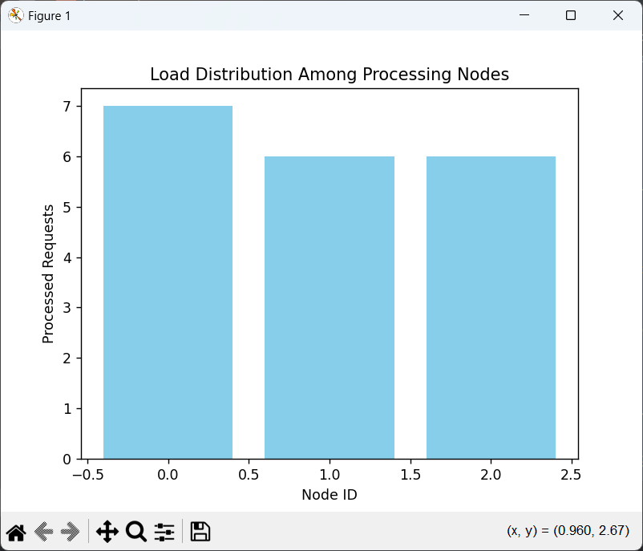
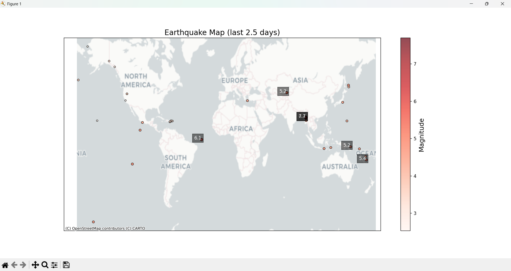

**Варіант 15** 

## Практична №1

Створити клас, що реалізує стек, використовуючи лише один список.

## Практична №2

Кешування .apply(). Використайте functools.lru_cache для кешування результатів всередині .apply().

## Практична №3
Використовуючи Faker, створіть набір випадкових даних для енергетичних показників (споживання, генерація) для різних типів споживачів (домогосподарства, підприємства).
 Оцініть коректність та корисність згенерованих даних для тестування алгоритмів прогнозування.

Оцінка точності прогнозування споживання електроенергії на основі типу споживача та кількості згенерованої електроенергії.

Значення **RMSE** **(718.76)** не надто високе.

**MSE** є великою, що може вказувати на наявність великих помилок.

**R²** на рівні 0.79 показує, що модель добре справляється з прогнозуванням і пояснює значну частину варіації в даних.

## Практична №4
15. Оптимізація навантаження на IoT-мережі

Реалізуйте алгоритм інтелектуального балансування навантаження для розподілених IoT-датчиків, що збирають дані про споживання енергії. Порівняйте із статичними стратегіями балансування.

Реалізована програма моделює балансування навантаження у мережі IoT, де датчики передають дані на обчислювальні вузли для обробки.

Основні компоненти:

* **IoTSensor** – імітує датчик, який генерує випадкові дані про споживання енергії.

* **ProcessingNode** – вузол обробки, який отримує дані у черзі та обробляє їх із певною затримкою.

* **LoadBalancer** – балансувальник навантаження, який розподіляє запити між вузлами за стратегією round_robin (по черзі) або least_response_time (до менш завантаженого вузла).

Процес роботи:

* Створюються 3 вузли обробки, які працюють у фонових потоках.

* 5 датчиків випадковим чином генерують дані.

* Дані передаються балансувальнику, який направляє їх у чергу обробки відповідного вузла.

## Практична №5
15. Обробка та візуалізація геопросторових даних: Використовуючи geopandas, обробити та візуалізувати геопросторові дані на карті.

Реалізована програма обробляє та візуалізує дані про землетруси за останні 2,5 дні на карті, використовуючи бібліотеки pandas, geopandas, shapely, contextily та matplotlib.

* На карті відображені всі землетруси з магнітудою >1.
* Магнітуда впливає на розмір і колір точок.
* Сильні землетруси (магнітуда >5) підписані.
* Використана фонова карта CartoDB.Positron.