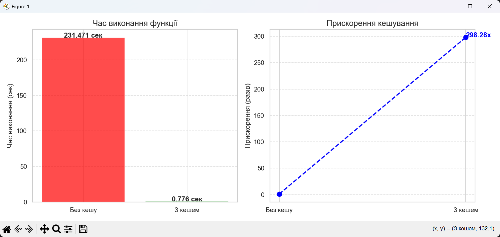
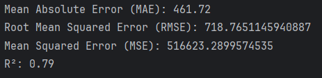
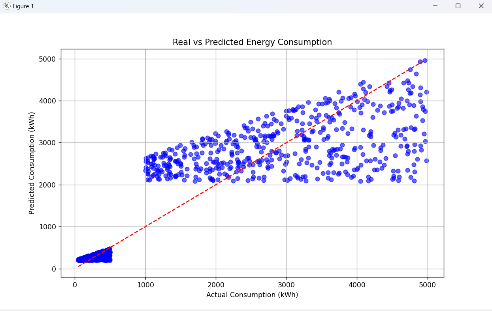

**Варіант 15** 

## Практична №1

Створити клас, що реалізує стек, використовуючи лише один список.

## Практична №2

Кешування .apply(). Використайте functools.lru_cache для кешування результатів всередині .apply().

## Практична №3
Використовуючи Faker, створіть набір випадкових даних для енергетичних показників (споживання, генерація) для різних типів споживачів (домогосподарства, підприємства).
 Оцініть коректність та корисність згенерованих даних для тестування алгоритмів прогнозування.

Оцінка точності прогнозування споживання електроенергії на основі типу споживача та кількості згенерованої електроенергії.

Значення **RMSE** **(718.76)** не надто високе.

**MSE** є великою, що може вказувати на наявність великих помилок.

**R²** на рівні 0.79 показує, що модель добре справляється з прогнозуванням і пояснює значну частину варіації в даних.

